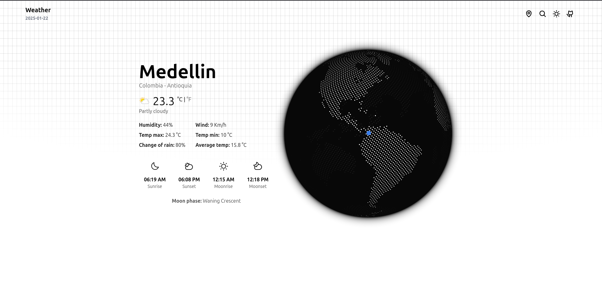

<div align="center">
  <a href="">
  
</div>

## 📦 Stack

- [**Vue**](http://vuejs.org/) - An approachable, performant and versatile framework for building web user interfaces.
- [**Typescript**](https://www.typescriptlang.org/) - JavaScript with syntax for types.
- [**Vue Router**](https://router.vuejs.org/) - The official Router for Vue.js.
- [**swrv**](https://docs-swrv.netlify.app/) - A Vue library for data fetching.
- [**Phosphor Icons**](https://phosphoricons.com/) - A flexible icon family for interfaces.

## 🚀 Install

1. Clone the repository and move to the project directory:

```bash
# Clone repository
git clone https://github.com/AndresGalloM/weather.git

# Move to project directory
cd weather
```

2. Install dependencies:

```bash
# Install dependencies:
npm install
```

3. Create a `.env` with the following content:

```bash
VITE_RAPIDAPI_KEY
VITE_RAPIDAPI_HOST
```

How to generate the RAPIDAPI_KEY?

- Create a free [RapidApi](https://rapidapi.com/) account.
- Go to [WeatherApi.com](https://rapidapi.com/weatherapi/api/weatherapi-com/).
- Click on "Pricing" -> "Basic" -> "Subscribe".
- Copy the host and the generated Key in the .env file.

4. Run the app:

```bash
npm run dev
```
